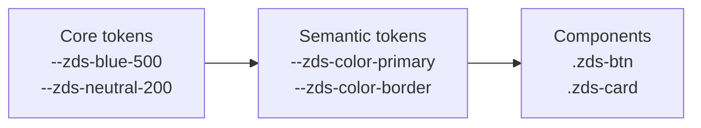

import { TokenTree } from "/snippets/token-tree.jsx";
import { TokenBrowser } from "/snippets/token-browser.jsx";

## Architecture

ZDS tokens are layered. Components never reference core values directly — they consume semantic tokens, which is what makes theming (including dark mode) a one-file change.



| Tier          | Example                | Rule                                             |
| :------------ | :--------------------- | :----------------------------------------------- |
| **Core**      | `--zds-blue-500`       | Raw values. Never used by components directly.   |
| **Semantic**  | `--zds-color-primary`  | Meaning, not appearance. The only tier components consume. |
| **Component** | `.zds-btn` internals   | Resolved from semantic tokens at build time.     |

## Token relationships

Select a primitive to see every semantic token that aliases it, then every component that consumes those aliases. This is the blast radius of a hex change — the relationship graph, not a list of references.

<TokenTree />

<Note>
  Dark mode remaps the semantic tier only. The primitive → alias links above are the light theme; toggle this page's theme and the semantic swatches follow.
</Note>

## Token browser

Search, filter, and copy any token. **Alias** shows the primitive a semantic token resolves to. **Used by** lists the next layer — semantic aliases for primitives, component pages for everything else. The **Copy** button copies the ready-to-paste `var(--zds-…)` reference.

<TokenBrowser />

## Using tokens

<CodeGroup>

```css CSS
.my-panel {
  background: var(--zds-color-bg-surface);
  border: 1px solid var(--zds-color-border);
  border-radius: var(--zds-radius-lg);
  padding: var(--zds-space-5);
  box-shadow: var(--zds-shadow-1);
}
```

```jsx React
import { tokens } from "@zenith/ui";

const panel = {
  background: tokens.color.bgSurface,
  padding: tokens.space[5],
};
```

</CodeGroup>

<Note>
  Dark mode is a semantic-tier remap: the same component CSS renders correctly in both themes because only the semantic values change. Toggle this page's theme to watch every preview above adapt.
</Note>
