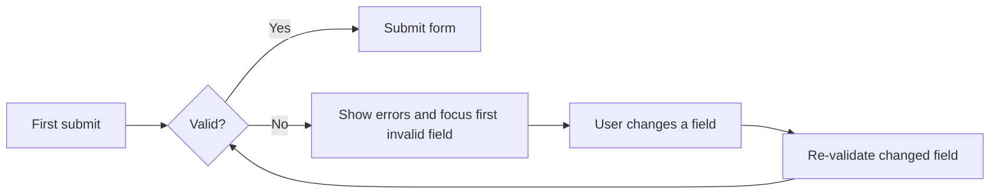

## Live example

This is a working form — submit it empty to see the validation pattern, then fix the fields.

import { FormPatternDemo } from "/snippets/form-pattern-demo.jsx";

<FormPatternDemo />

## Anatomy

| Slot            | Component                              | Rule                                            |
| :-------------- | :------------------------------------- | :----------------------------------------------- |
| Fields          | [Input](/components/input), [Select](/components/select) | Stacked vertically, `space-5` apart |
| Settings        | [Toggle](/components/toggle)           | Toggles apply on submit inside forms, not immediately |
| Actions         | [Button](/components/button)           | Right-aligned; primary action last               |
| Result feedback | [Alert](/components/alert)             | Replaces the form or renders above it            |

## Validation rules

1. **Validate on submit, re-validate on change.** Don't show errors while the user is still typing their first attempt.
2. **Error messages say how to fix it** — "Use lowercase letters, numbers, and hyphens only", not "Invalid input".
3. **The error replaces the hint**, in the same position, so the layout never jumps.
4. **Focus moves to the first invalid field** after a failed submit.
5. Keep forms to one column. Multi-column forms measurably increase completion time and error rates.

## Buttons in forms

- Primary button text names the outcome: **Create tunnel**, not **Submit**.
- The secondary action is always **Cancel** and never visually competes — use the `secondary` variant.
- Disable the primary button only while a submit is in flight (use the `loading` prop); never disable it for incomplete input — let validation explain instead.
